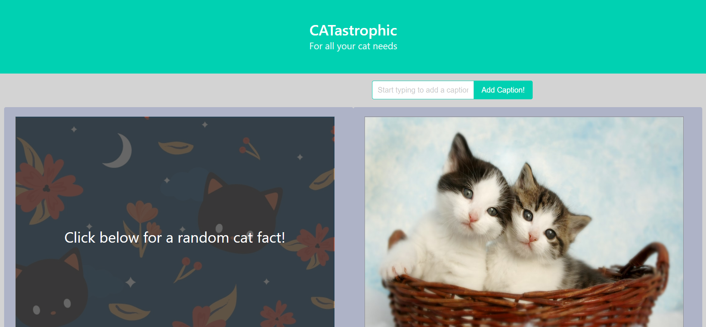

# CATastrophic

Enjoy this website all about cats!

## User Story:
* AS A cat enthusiast...
* I WOULD like a website all about cats...
* WHERE I can view adorable cat pictures while learning awesome cat facts!

## Features:
* Click the button to display cat facts and the button to display cat images
* Use the input field to add a caption to the cat image!

## Built With:
* HTML
* CSS
* Bulma Framework
* JavaScript
* CATAAS API (https://cataas.com)
* Cat-Fact API (https://cat-fact.herokuapp.com)

## Website:
https://hollenbebe08.github.io/project-catastrophic/

## Contributions:
* Zachary Pawloski 
* Rosa Turner
* Betsy Griffith
* Austin Davis

## Future Enhancements:
* Search for cat captions with API/autocomplete tags
* Append the chosen caption to the cat image
* Further user interactivity allowing users to create accounts and share and/or save cat images and facts

## Deployed Site Screenshot:
